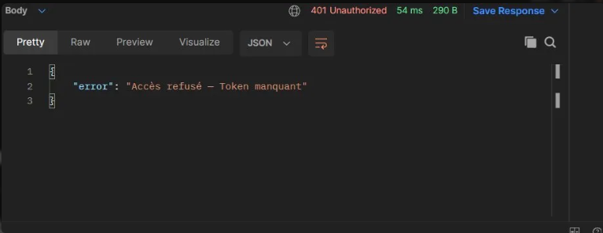
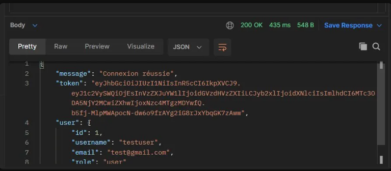
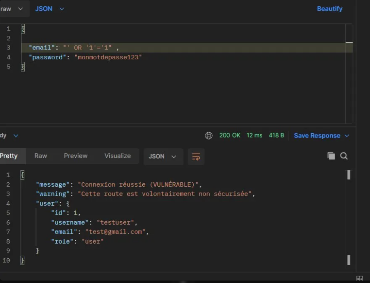
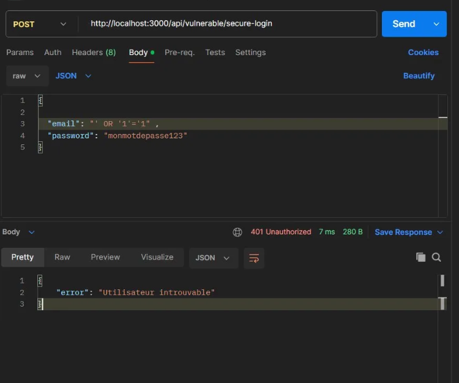
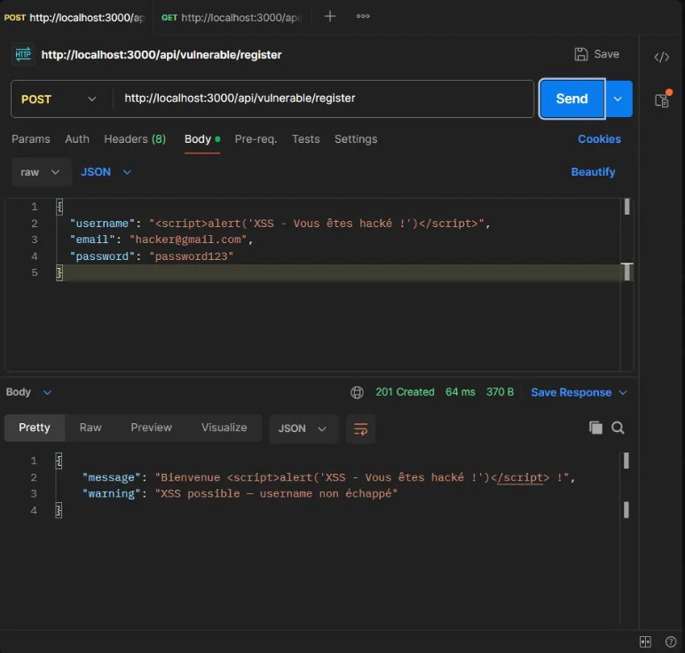
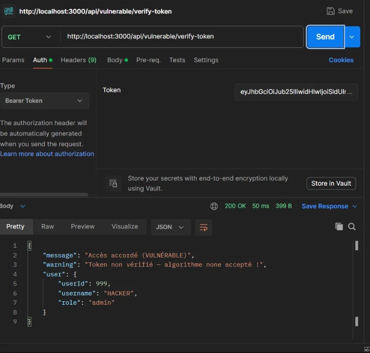
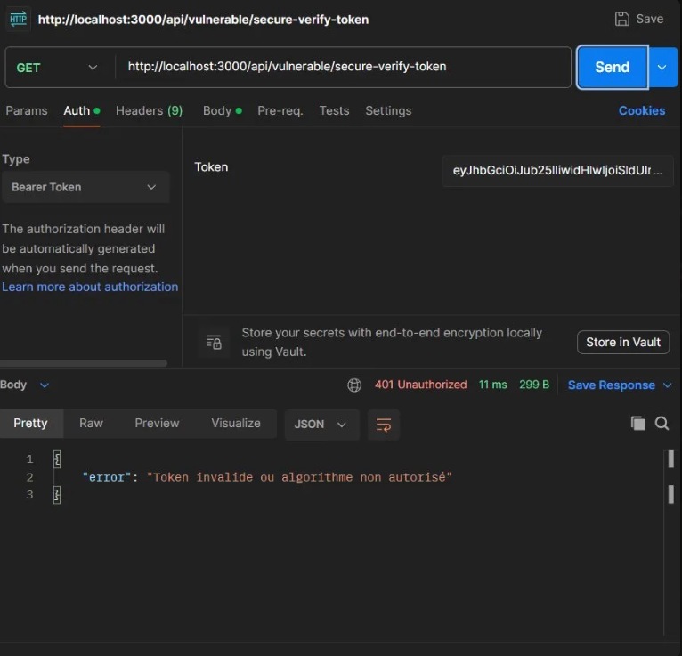
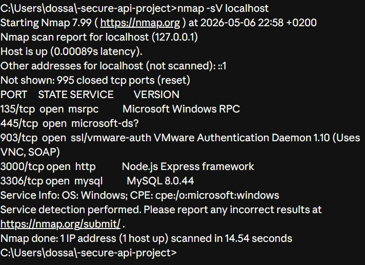
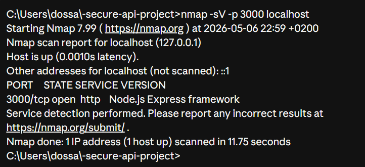
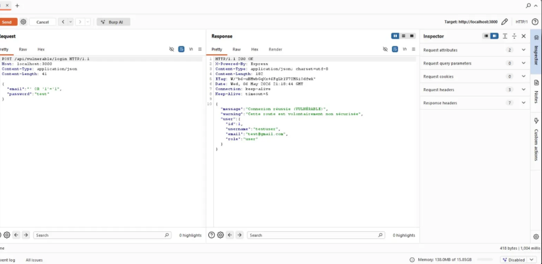

# 🔐 Rapport de Tests de Sécurité

## Phase 3 — Failles & Corrections

### 1. Middleware JWT

**Sans token → Accès refusé :**



**Avec token → Accès accordé :**



---

### 2. SQL Injection

**Attaque réussie sur la route vulnérable :**



**Attaque bloquée sur la route sécurisée :**



---

### 3. XSS (Cross-Site Scripting)

**Script malveillant stocké sur la route vulnérable :**



**Script neutralisé sur la route sécurisée :**


---

### 4. Mauvaise gestion JWT

**Faux token admin accepté (algorithme none) :**



**Faux token rejeté (jwt.verify + HS256) :**



---

## Phase 4 — Tests de Sécurité

### 1. Nmap — Scan des ports

**Scan global :**



**Scan ciblé port 3000 :**



| Port | Service | Risque en production |
|---|---|---|
| 3000 | Node.js Express | Protéger avec Nginx |
| 3306 | MySQL 8.0.44 | Fermer avec firewall |

---

### 2. Burp Suite — Interception des requêtes

**Connexion normale interceptée :**


**SQL Injection depuis Burp Suite :**



---

### 3. OWASP ZAP — Scan automatique

**3 alertes détectées :**


| Alerte | Niveau | Correction |
|---|---|---|
| CSP manquante | Moyen | Content-Security-Policy header |
| X-Powered-By exposé | Faible | app.disable('x-powered-by') |
| X-Content-Type-Options manquant | Faible | Header nosniff |

---

## Corrections recommandées en production

```javascript
// Ajouter Helmet.js pour tous les headers de sécurité
import helmet from 'helmet';
app.use(helmet());

// Supprimer X-Powered-By
app.disable('x-powered-by');
```

> En production : Nginx comme reverse proxy + Firewall pour fermer les ports inutiles